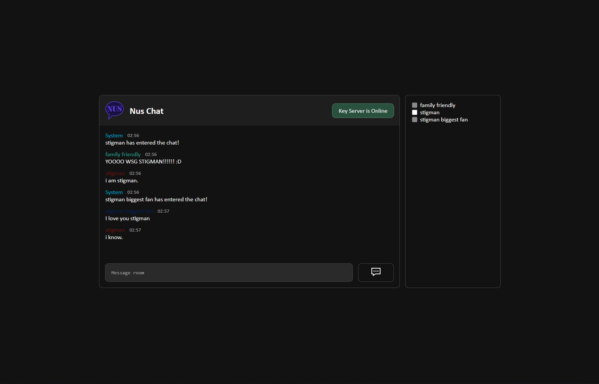
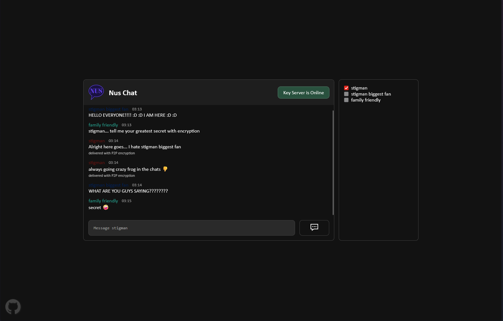
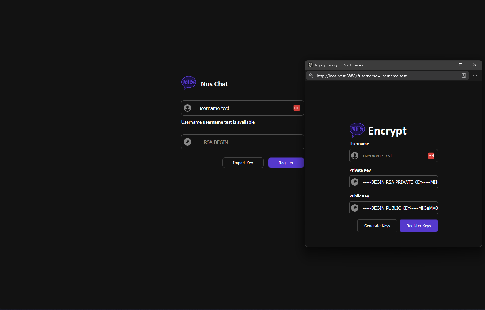

<h1>
  
  Nus Chat
</h1>

> Probably the worlds greatest chat app. 
> No investors, no users, no problem!

## Features

### Messaging Group

You can chat with people on this chat app. Our engineers have been working day and night to implement chatting to the chat app. If you're lucky you might be able to chat with **STIGMAN** (the greatest demo user to ever exist) himself.

### Messaging Specific Users

An imporant part of **Nus Chat** is the E2E encryption. Sometimes you want to chat away from prying eyes. You can select one or more recipients from the sidebar and any messages sent will be only readable by these users. If no recipient is selected we default to no encryption which makes the messages readable by anyone in chat.

### Ez Key Sync

Instead of users having to go to the [**Key Server**](./labb2_key_server/) and setting up their keys from there and then navigating back to **Nus Chat** they are prompted to import keys directly from the registration page. This uses the [`window.postMessage()`](https://developer.mozilla.org/en-US/docs/Web/API/Window/postMessage) API to automatically insert the private key when the user has registered their key on the key server.

